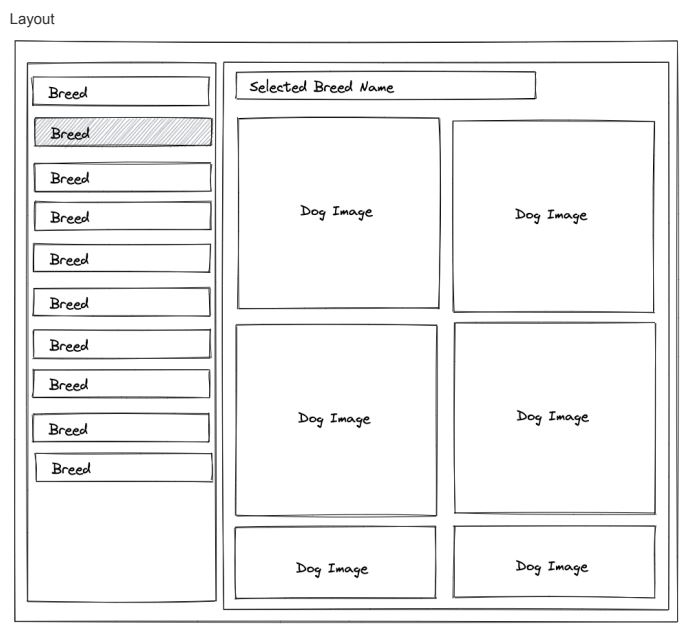

# My CEO Dog Code Challenge

Let’s build a small site using the cute Dog.ceo API as a data source.

## Info

Layout



## Tasks

### Task #1 Display a list of all breeds
-   Create a sidebar on the left
-   Display list of available breeds in the sidebar

Endpoint for the breeds: https://dog.ceo/dog-api/documentation/

```https://dog.ceo/api/breeds/list/all```

The API returns the breeds in the following format:

```$xslt
{
    "message": {
    "affenpinscher": [],
    "african": [],
    "bulldog": [
        "boston",
        "english",
        "french"
    ],
    "mastiff": []
    }
}
```

These should be displayed in our list as:

```$xslt
affenpirscher
african
boston bulldog
english bulldog
french bulldog
mastiff

```

### Task #2 Display a list of all breeds

-   Make the list items selectable via click, where only one of them is selected at a time
-   Create a main content section on the right of the page
-   Show the name of the selected breed as a header in the content section
-   Display a grid or list of dog images for the selected breed

Endpoint for the images of a breed: https://dog.ceo/dog-api/documentation/breed

```$xslt
https://dog.ceo/api/breed/${BREEDNAME}/images
Example: https://dog.ceo/api/breed/hound/images
```

## Please note
the idea behind this task is to measure your adaptation to work with tools that you did not use before. 
- We would like you to implement this using Redux-Toolkit including the Redux-Query.
- no need for fancy UI
